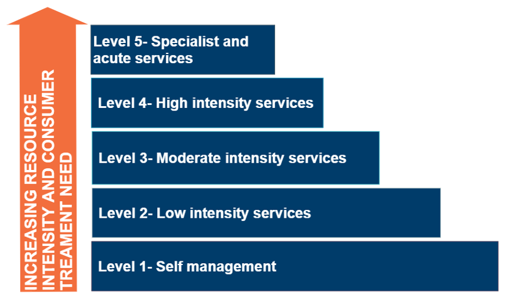

Overview
==========

This section describes the different levels of care. The information gathered through the initial assessment is used to recommend a level of care and inform a referral decision. The levels of care do not replace individualised assessment and care - instead, providing information to guide decision-making.

It is important to emphasise that the referral criteria are offered only to guide judgements about the recommended level of care. Each presenting child, parent/caregiver, and family will have unique requirements that must always take precedence in decision making.

There are five levels of care (depicted in :numref:`figure_child_level_of_care`). Each level of care is differentiated based on the intensity of the mental healthcare available at each level. There may be a gap in services available at some or all levels of care. The determined level of care applies irrespective of service availability. Referrers may need to take a flexible approach (e.g., telehealth services or bundling services as part of a care package) to achieve the required service intensity. 

.. _figure_child_level_of_care:

   
   Schematic representation of levels of care

An important additional consideration is the type and appropriateness of the resources or services recommended. Users of the Decision Support Tool should actively consider and incorporate decisions about resource or service type and appropriateness when considering resource or service options that are personalised to the unique needs of each child. 

When making a resource recommendation or referral decision at any level of care, consider the type of resources or service options that account for the perspectives and preferences of the child, such as:

   * Culturally appropriate and safe services (such as social and emotional wellbeing services available through Aboriginal Community Controlled Health Organisations).
   * Developmentally appropriate services.
   * Services specific to the child’s diagnosis (where applicable).
   * Specialist sexuality and gender diversity resources or services.
   * If the child or their family have multiple service needs, consider options for integrated services and service models.
   * Services that can sensitively incorporate social and environmental supports (e.g., specialist family violence services). 
   
When making a resource recommendation or referral decision at any level of care, consider the circumstances of the child and the family and the appropriateness of resources or service options, such as:

   * Readiness of the child and parent/caregivers.
   * The priorities of the child and the parent/caregivers.
   * Cost.
   * Location.
   * Availability of in-language, interpreter, or translator services.
   * Literacy of the child and parent/caregiver.
   * The availability of technology (e.g., internet connection, telephone).
   * The practical and emotional support needs of the child, their parent/caregiver, and family. 
   
The recommended levels of care focus on the mental health-related resources or services that are likely to be required by the child. However, the mental health and well-being of the child, parent/caregivers and family are often interrelated. It is important to offer the parent/caregiver and family members an opportunity to discuss the resources or services they might benefit from. 

.. admonition:: PRACTICE POINT - Involving children in decision making

   Supported decision-making strategies for initial assessment and referral:
   
      * Ensure the child and their parent/caregiver are provided with information using their preferred way of receiving information (e.g., written/verbal/visual, English/other languages, with/without a support person). Take care to provide information to the child that is age, developmentally and culturally appropriate.
      * Ensure the child and their parent/caregiver are provided with information about the range of services and support available (including the option of no service) and encourage the child and parent/caregiver to contribute their options, ideas, solutions, and expectations. This might include culturally important activities or self-care strategies.
      * Ensure the child and their parent/caregiver can express any concerns or fears about the options (e.g., cost, travel, previous positive or negative experiences).
      * Be prepared to talk about the pros and cons of each option (e.g., intensity, length of service engagement, commitment required, waiting periods, the potential impact on symptoms).
      * Check-in to ensure the child and parent/caregiver has understood the information provided and ensure enough time for any questions.
   
   For more information and advice about supported decision-making and children, visit:
   https://emergingminds.com.au/resources/supporting-childrens-participation-through-shared-decision-making-in-child-mental-health-care/ 

   https://emergingminds.com.au/resources/practical-strategies-for-engaging-children-in-a-practice-setting/   

