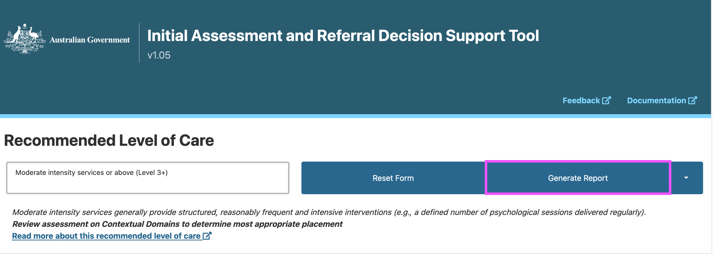
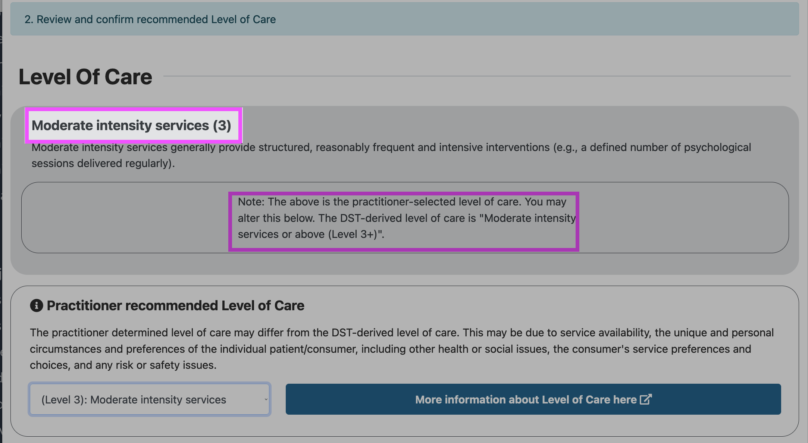
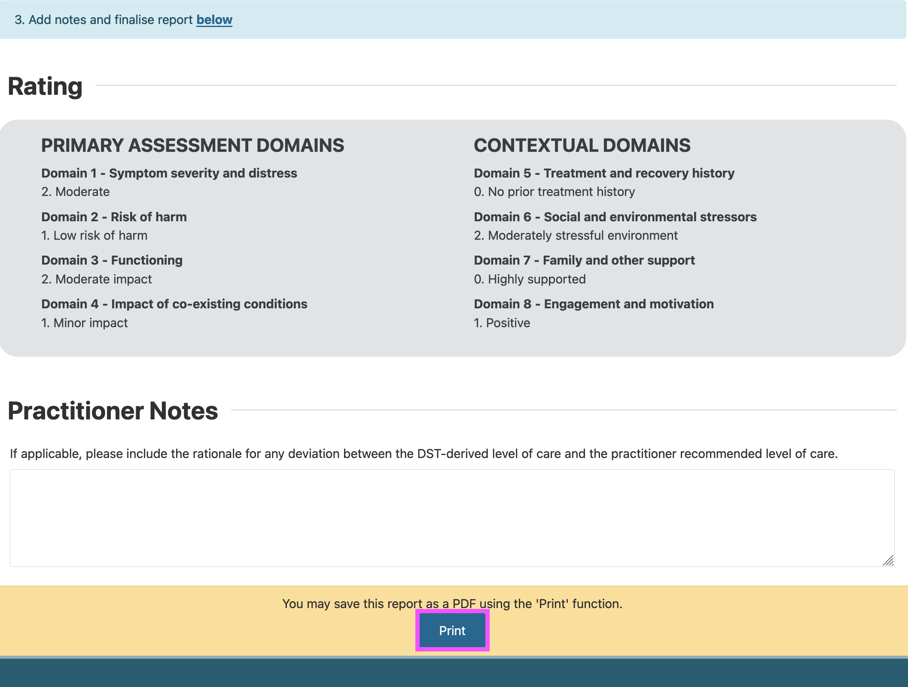

Generating a PDF report
=======================

You can generate a PDF report of the results for your records by clicking ‘Generate Report’.

..    :width: 400px
    :align: center
    :alt: Location of 'Generate Report' button

Confirming or changing the Level of Care
----------------------------------------

Where the DST algorithm calculates a Recommended Level of Care but notes that the practitioner should **review the assessment on Contextual Domains to determine most appropriate placement**, the practitioner-selected Level of Care will automatically default to the base level of care.

..    :width: 400px
    :align: center
    :alt: Location of DST-derived Level of Care where practitioner needs to review the assessment

Practitioners may determine a different level of care from the DST-derived level of care. This may be due to service availability, the unique and personal circumstances and preferences of the individual patient/consumer, including other health or social issues, the consumer's service preferences and choices, and any risk or safety issues.

For example, in the screenshot below the DST-derived level of care is "Moderate intensity services or above (Level 3+)", but the default Practitioner recommended Level of Care
is **Moderate intensity services (3)**. The practitioner can change the **Practitioner recommended Level of Care** if they assess the patient as requiring a different Level of Care.

.. image:: img/changing-loc.png
..    :width: 400px
    :align: center
    :alt: Location of drop down to change Recommended Level of Care based on practitioner assessment.

Printing or saving the Report
-----------------------------

Once the practitioner has completed the relevant fields, including adding Practitioner Notes regarding the rationale for any deviation between the DST-derived level of care and the practitioner recommended level of care, they can either *print* the report or *save* the report as a PDF.

..    :width: 400px
    :align: center
    :alt: Location of 'Print' button

The print dialog screen offers users the option to **save the report as a PDF**. The example below shows the print dialog screen for Firefox. Similar options will be available in other modern browsers.

.. image:: img/print_dialog.png
..    :width: 400px
    :align: center
..    :height: 742px
    :alt: Location of 'Save to PDF' option in Firefox.
