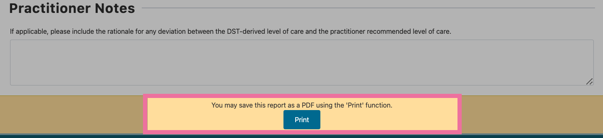

Generating a PDF report
==========================

A customisable Report is able to be generated for the user to either print a hardcopy of the results or to be saved as a PDF using your browsers native operating system functionality. 

For privacy purposes, this form does not transmit or store any information. Once the page is closed, you cannot retrieve the information. 

.. contents::
   :local:
   :depth: 2

-------

Step 1 - Access 'Generate Report' form
----------------------------------------

Once you have provided a response for each of the 8 domains, you will see that
the `Generate Report` button is active.

1. Click the `Generate Report` button
2. A new browser page will open displaying the current results along with additional form fields. 

------

Step 2 - Provide details
--------------------------

The Generate Report form is split into 4 sections:
  
   * :ref:`Patient Details<patient-details>`

   * :ref:`Level of Care<level-of-care>`

   * :ref:`Rating<rating>`

   * :ref:`Practitioner Notes<prac-notes>`

.. _patient-details:

**1. Patient Details** - this sections contains the following fields, all of which are mandatory:

      * Patient Name
      * Patient Unique Identifier
      * Patient Date of Birth
      * Practitioner's Name
      * Date and time rating was generated (*system generated*)

  .. image:: img/iar_dst_patient_details.png
      :alt: Example patient details section
      :width: 80%

.. _level-of-care:

**2. Level of Care** - this sections contains the following:

      * The DST-derivied level of care
      * Option to define the Practitioner's recommended Level of Care

  .. image:: img/iar_dst_level_of_care.png
      :alt: Example of level of care section
      :width: 80%

.. _change-loc:

Confirming or changing the Level of Care
^^^^^^^^^^^^^^^^^^^^^^^^^^^^^^^^^^^^^^^^^

The DST algorithm calculates a Recommended Level of Care but notes that the practitioner should **review the assessment on Contextual Domains to determine most appropriate placement**, which can be found in the reports' :ref:`Rating<rating>` section. The practitioner-selected Level of Care will automatically default as the displayed base level of care :ref:`(1)<loc>`.

Practitioners may determine a different level of care from the DST-derived level of care :ref:`(2)<loc>`. This may be due to service availability, the unique and personal circumstances and preferences of the individual patient/consumer, including other health or social issues, the consumer's service preferences and choices, and any risk or safety issues.

.. _loc:

The practitioner can change the **Practitioner recommended Level of Care**  if they assess the patient as requiring a different Level of Care :ref:`(3)<loc>`. 

.. _rating:

**3. Rating** - this sections contains the following static information:

      * Primary Assessment Domains scores
      * Contextual Domains scores

  .. image:: img/iar_dst_rating.png
      :alt: Example of ratings section
      :width: 80%

.. _prac-notes:

**4. Practitioner Notes** - this sections contains a free text field for practitioner notes. If relevant, this could include the rationale for any :ref:`deviation between the DST-derived level of care and the practitioner recommended level of care<change-loc>`.

  .. image:: img/iar_dst_notes.png
      :alt: Example of open ended notes section
      :width: 80%

------

Step 3 - Print and/or Save Report
----------------------------------

Once the practitioner has completed the relevant fields the `Print` button will become active.

Clicking the `Print` button will open the print ready version of the report and bring up the browser's native print dialog screen where the practitioner can either *print* the report or *save* the report as a PDF.

The print dialog screen offers users the option to **save the report as a PDF**. The example below shows the print dialog screen for Firefox. Similar options will be available in other modern browsers.

From the printable report page, information dispalyed can be changed by clicking `Edit Report` :ref:`(1)<print-report>` button, or Practitioner can click `Reset Form` :ref:`(2)<print-report>` button to complete a new IAR-DST form.

.. _print-report:

