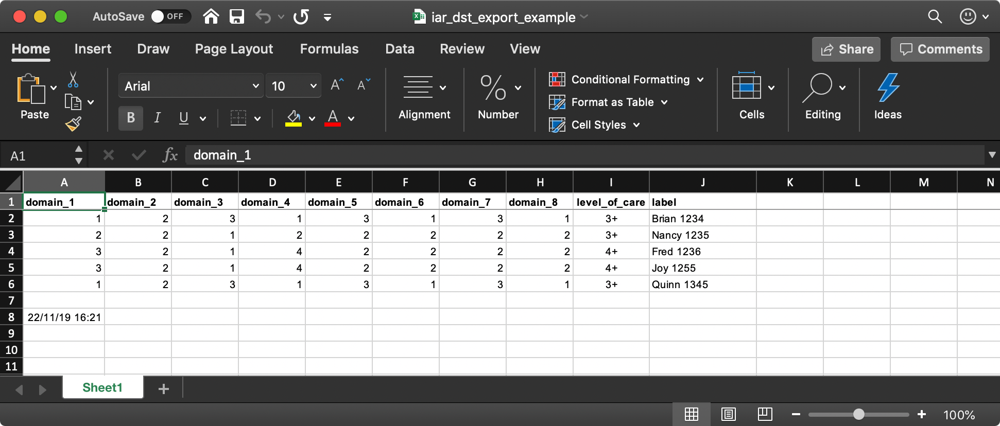

Saving your results
=====================

Step 1
-------
Once you have provided a response for each of the 8 domains, you will see that the `Copy Result` button is now active.

.. image:: img/IAR_DST-CopyResultButtonActive.png
    :width: 600px
    :align: center
    :height: 771px
    :alt: Location of 'Copy Result' button

Clicking the arrow to the right of the `Copy Result` text will provide you with the option to download your results.

.. image:: img/IAR_DST_DownloadResultOption.png
    :width: 600px
    :align: center
    :height: 761px
    :alt: Example of location of 'Download results' option

Step 2
-----------

You have now downloaded your first set of results as a .csv file. The filename will be `iar_dst_export.csv`. (do we need to tell them where to find the file? like "depending on your browsers settings, your file will most likely be in your computers' 'downloads' folder")

Open your file using a program such as Microsoft Excel or Numbers.

.. image:: img/iar_dst_export.png
*Example of file when opened with Excel

Step 3
--------
Add in an identifier column to the end of what will become your master spreadsheet. In our example we have used `label` and populated it with the patients client number.

.. image:: img/iar_dst_export-id-column.png
* Example of including an identifier column

Step 4
--------
Subsequent rows can be added by downloading your next set of results using `Copy Result` again. You can then open the new result .csv file and copy and paste the new results into your master spreadsheet.

* Example of layout for master spreadsheet

Example Spreadsheet
^^^^^^^^^^^^^^^^^^^^

You can :download:`download our example spreadsheet <iar_dst_export_example.xlsx>` to use as a guide for saving your responses
     

