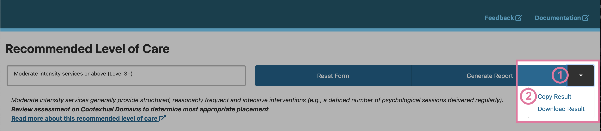

Saving your results
=====================

Step 1 - Download results
---------------------------
Once you have provided a response for each of the 8 domains, you will see that the `Copy Result` button is active.

Clicking the arrow to the right of the `Copy Result` text will provide you with the option to download your results.

.. image:: img/IAR_DST_DownloadResultOption.png
    :width: 600px
    :align: center
    :height: 761px
    :alt: Example of location of 'Download results' option

Step 2 - Locate and open results
----------------------------------

You have now downloaded your first set of results as a .csv file. The filename will be `iar_dst_export.csv`.

Open your file using a program such as Microsoft Excel or Numbers.

Step 3 - Add a unique identifier
----------------------------------
Add in an identifier column to the end of what will become your master spreadsheet. In our example, we have used `label` and populated it with the patient's client number.

Step 4 - Build a master spreadsheet
------------------------------------
When you are ready, you can reset your assessment form in order to complete for your next patient. Please see our instructions on :ref:`resetform`.

Subsequent rows can be added by downloading your next set of results using `Copy Result` again. You can then open the new result .csv file and copy and paste the new results into your master spreadsheet.

.. image:: img/iar_dst_export_example.png
    :alt: Example of layout for master spreadsheet

Download example spreadsheet
------------------------------

You can :download:`download our example spreadsheet <iar_dst_export_example.xlsx>` to use as a guide for saving your responses.
     

