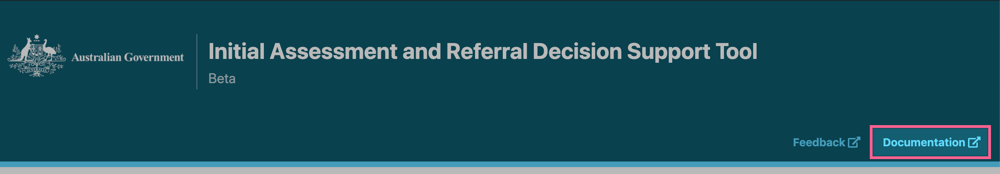
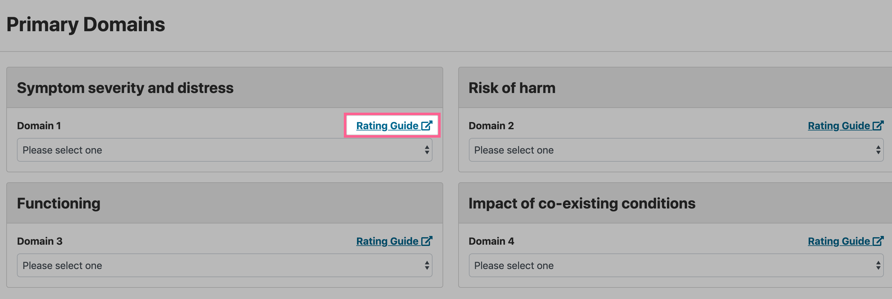
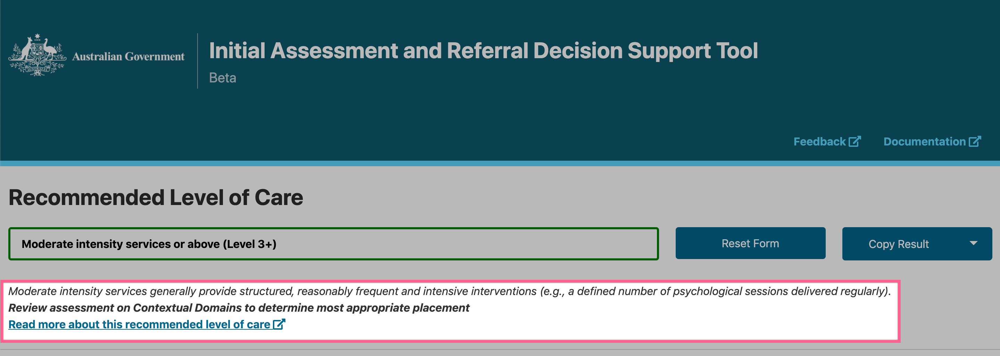
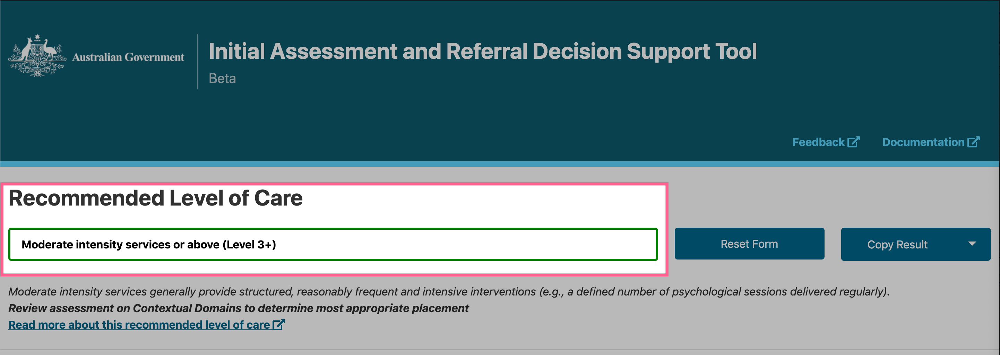
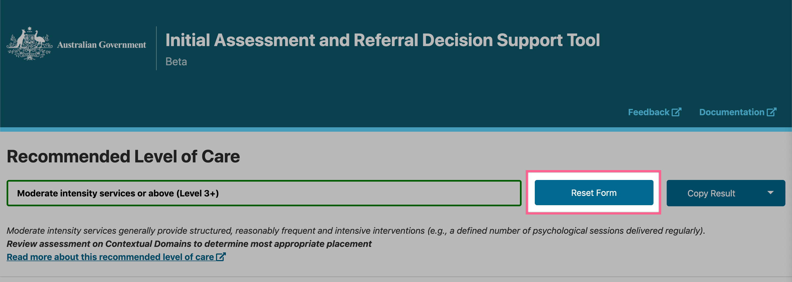

Using the Tool
================

Available help guides
----------------------

Documentation
^^^^^^^^^^^^^^

Before you begin your assessment, you may like to view our Documentation. You can do this by clicking the blue text `Documentation` at the top of your webpage.  The `Documentation` will open in either a new browser window or tab, depending on your browser's default settings. Simply close the browser window/or tab to return to the DST.

..    :width: 600px
    :align: center
..    :height: 742px
    :alt: Location of link to 'Documentation'

Rating Guide
^^^^^^^^^^^^^^

As you work your way through the domain responses, you should click on a `Rating Guide` to view additional information about that domain. The `Rating Guide` will open in either a new browser window or tab, depending on your browser's default settings. Simply close the browser window/or tab to return to the DST.
   

..    :width: 600px
    :align: center
..    :height: 742px
    :alt: Location of 'Rating Guide' for Domain 1

Recommended Level of Care
^^^^^^^^^^^^^^^^^^^^^^^^^^

Once you have calculated a 'Recommended Level of Care', further information on the result should be viewed by clicking the blue text `Read more about this recommended level of care`. 

..    :width: 600px
    :align: center
..    :height: 771px
    :alt: Location of further information on 'Recommended Level of Care'

Operating the tool
---------------------

Calculating Level of Care
^^^^^^^^^^^^^^^^^^^^^^^^^^^

A score for each of the 8 domains will need to be selected before a `Recommended Level of Care` can be calculated. Further information on the calculated Level of Care should be viewed by clicking the blue text `Read more about this recommended level of care`. 

For ease of use, the `Recommended Level of Care` results will stay at the top of your browser's page when you scroll.

..    :width: 600px
    :align: center
..   :height: 771px
    :alt: Location of 'Recommended Level of Care'

Saving results
^^^^^^^^^^^^^^^

Your results can be downloaded as a .csv file by clicking the arrow on the `Copy Results` button, then selecting `Download Results`. Please see our :doc:`instructions on downloading your results and our suggestions on saving them for future use<saving-results>`.

.. _resetform:

Resetting the assessment
^^^^^^^^^^^^^^^^^^^^^^^^^^

When you are ready to start a new form, please click the `Reset Form` button, located to the right of the `Recommended Level of Care`.

..    :width: 600px
    :align: center
..    :height: 771px
    :alt: Location of 'Reset Form' button

